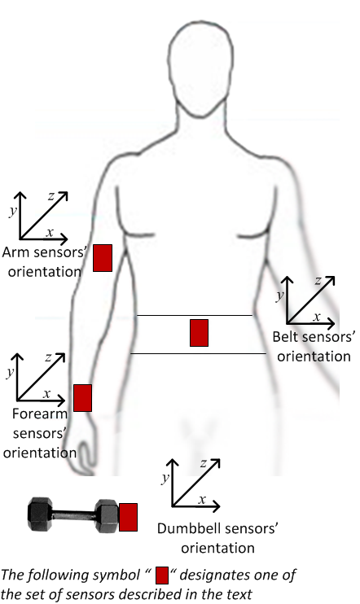

```{r setup, include=FALSE}
knitr::opts_chunk$set(fig.path = "plots/plot-")
```

## Executive Summary

This short report aims to predict the quality of execution of a weightlifting excercise (Unilateral Dumbbell Biceps Curls). The data stems from the [Weight Lifting Exercises Dataset](http://groupware.les.inf.puc-rio.br/har#weight_lifting_exercises/). The dataset records the quality of execution of this excercise by 6 male participants (between 20 and 28 years old;  little weight lifting experience). The participants were instructed to perform several sets of 10 repetitions, each set in one of the following 5 different manners:

1. Exactly according to the specifications (i.e., correctly) (class A)
2. Throwing the elbows to the front (class B)
3. Lifting the dumbbell only halfway (class C)
4. Lowering the dumbbell only halfway (class D)
5. Throwing the hips to the front (class E).

While performing the exercise, accelerrations of different parts of the body and dumbbell were measured using sensors alongside the quality of the exercise. The location of the sensors is depicted in the following figure (source: http://groupware.les.inf.puc-rio.br/har#weight_lifting_exercises):

<p align="center">
  
</p>

We will use the acceleration data to predict the execution quality for 20 samples of the data using a simple classification tree and a random forest. The accuracy of the random forest is found to be very high () while that of the simple classification tree is moderately high (). 

Using the random forest, it is found that we are able to predict all 20 samples correctly. This is not surprising as, given the accuracy of the random forest, the probability to find all 20 samples to be correct is (). 


## Data preprocessing
### Required Packages

```{r required-packages, results=FALSE, message=FALSE,warning=FALSE}
require(caret)
require(dplyr)
require(rattle)
require(rpart)
```

### Data downloading

First, we are downloading the data

```{r load-data, cache=TRUE}
download.file('https://d396qusza40orc.cloudfront.net/predmachlearn/pml-training.csv','pml-training.csv')
download.file('https://d396qusza40orc.cloudfront.net/predmachlearn/pml-testing.csv', 'pml-testing.csv')
data_labeled <- read.csv('pml-training.csv')
data_unlabeled <- read.csv('pml-testing.csv')
n.testing <-  dim(data_unlabeled)[1]
```

### Data inspection

Each row corresponds to a point measurement of different components of the movement. The labeled dataset (`data_labeled`) has `r dim(data_labeled)[1]` rows and `r dim(data_labeled)[2]` columns. The first 7 columns correspond to metadata and time-window specifications. The last column corresponds to the quality of the exercise ("classe") for the labeled data (`data_labeled`) respectively to a running number identifying the row for the prediction task ("problem_id") for the unlabelded data for which we are going to perform the prediction (`data_unlabeled`). The unlabeled dataset has only `r n.testing` rows, for each of which we are going to predict the quality of the exercise for that row.

Measurements have been taken at a frequency of about `r options(scipen=1, digits=3); 1/(length(unique(data_labeled$raw_timestamp_part_1)) / nrow(data_labeled))` Hz. In addition, the dataset contains aggregate values regarding the distribution of components calculated for sliding windows of 0.5 to 2.5 seconds each (columns starting with "kurtosis", "skewness", "max", "min", "amplitude", "var", "stddev", "avg"). 

The prediction we are going to perform is based on raw measurements; these aggregate values will therefore be ignored.

The remaining columns correspond to 

* raw measurements of the euler angle of the movement (column names starting with "roll", "pitch", "yaw") 
* column name starting with "total_accel"; it remains unclear what this exactly correpsonds to
* raw measurements of angular velocity (columns starting with "gyros"; x, y, z direction)
* raw measurements of acceleration (columns starting with "accel"; x, y, z direction)
* raw measurements of magnetometer (columns starting with "magnet"; x, y, z direction)

We are therefore left with 13 measurements at 4 locations, corresponding to 52 measurements. We will use these features for the prediction task. The same column names are valid both for the labeled and unlabeled dataset.

```{r colnames-predictors}
colnames.predictors <- colnames(data_labeled)[grep('^roll|^pitch|^yaw|^total_accel|^gyros|^accel|^magnet',colnames(data_labeled))]
data_labeled_2 <- data_labeled %>% select(c(colnames.predictors,c("classe")))
data_unlabeled_2 <- data_unlabeled %>% select(c(colnames.predictors,c("problem_id")))
```


## Prediction
### Accuracy estimation

To perform an independent estimation of Accuracy (i.e. an estimation of accuracy of the chosen method on samples for which we have not trained the model), we will create a training and a testing dataset.

```{r split-dataset, cache=TRUE}
set.seed(111)
inTrain <- createDataPartition(data_labeled_2$classe, p=0.8, list=FALSE)
training <- data_labeled_2[inTrain,]
testing <- data_labeled_2[-inTrain,]
```
 

### Simple Decision Tree

We will start our prediction exercise by fitting a simple decision tree to the data. This method performs hyperparameter tuning on the entire training dataset in the sense that it calculates an optimal complexity parameter `cp` that determines the fraction by which a new split has to improve the old candidate in order to be undertaken.
It is therefore necessary to measure the resulting accuracy on data for which this parameter tuning has not been performed.

For the accuracy measurement for a given value of `cp`, we are going to use k-fold cross-validation. This means that the accuracy for a given value of `cp` is estimated as the average of k out-of-bag accuracy measurements of all the data except one of the folds against the fold that was left out. 

```{r Simple-Decision-Tree 01, cache=TRUE}
set.seed(111)
k <- 10
repeats <- 10
ll <- 10
tuning.grid <- data.frame( cp=10^seq( -7, -1, length=ll ) )
fit.Control.Simple.DecisionTree <- trainControl(
  method = "repeatedcv",
  number = k, # k folds
  repeats = repeats # number of repetitions
  )
model.Simple.DecisionTree<-train(classe ~ .,
                               data=training, 
                               method="rpart", 
                               trControl = fit.Control.Simple.DecisionTree,
                               tuneGrid = tuning.grid)

```


This training procedure produces `r ll+1` different values for `cp` and calculates for each of them the out-of-bag accuracy. The following plot depicts how the accuracy depends on the model complexity. Complexities of lower than 1.e-4 level off at an accuracy value of about `r model.Simple.DecisionTree$results[1,"Accuracy"]`, while for `cp` > 1.e-3, accuracy drops sharply. 

```{r simple-Decision-Tree-results}
plot(model.Simple.DecisionTree, scales = list(x = list(log = 10)))
print(model.Simple.DecisionTree)
```


How is this model performing when assessed on the testing data?

```{r simple-Decision-Tree-testing}
prediction.Simple.DecisionTree <- predict(model.Simple.DecisionTree, testing)
cM.Simple.DecisionTree <- confusionMatrix(prediction.Simple.DecisionTree, testing$classe)
Accuracy.Simple.DecisionTree <- cM.Simple.DecisionTree$overall[1]
print(cM.Simple.DecisionTree)
```

This model is performing even *better* on the testing dataset than on the training dataset. On the testing dataset, the model achieves an accuracy of `r Accuracy.Simple.DecisionTree`, slightly larger than the accuracy estimate for the best `cp` value using hyperparameter (`r model.Simple.DecisionTree$results[1,"Accuracy"]`).

### Random Forest
The accuracy results for the simple decision tree are quite encouraging. However, given this accuracy, the probability get all `r n.testing` samples right is only `r dbinom(n.testing, size=n.testing, prob=Accuracy.Simple.DecisionTree)`. 

We are therefore now attempting to improve on the result of a single decision tree by fitting a random forest to the data. This means that we are combining the power of several weak classifiers to build a stronger one. 

```{r random-fores 01, cache=TRUE}
set.seed(111)
fit.Control.RandomForest <- trainControl(
  method = "oob"
)
model.RandomForest<-train(classe ~ .,
                          data=training, 
                          method="rf", 
                          trControl = fit.Control.RandomForest)

```


This training procedure produces 3 different random forests, each one with a different value of randomly selected predictors (`mtry`). The validation is done using the out-of-bag method, meaning that only those trees cast their votes for a given sample if they were not trained using that sample. This is therefore a correct estimation of accuracy if we only grow one random forest. 

However, as we used different random forests to tune the parameter `mtry`, we are again in the same situation as for the simple decision tree: we used the entire training dataset for hypertuning. We therefore still need to estimate the accuracy on the testing set.

The following plot depicts how the accuracy depends on the the number of features chosen for each tree. All values of `mtry` display a very high accuracy of larger than 98.8%, the best value is achieved for `mtry`=2 (accuracy=`r model.RandomForest$results[1,"Accuracy"]`). 

```{r random-forest-results}
plot(model.RandomForest)
print(model.RandomForest)
```

How is this model performing when assessed on the testing data?

```{r random-forest-testing}
prediction.RandomForest <- predict(model.RandomForest, testing)
cM.RandomForest <- confusionMatrix(prediction.RandomForest, testing$classe)
Accuracy.RandomForest <- cM.RandomForest$overall[1]
print(cM.RandomForest)
```

This model is also performing *better* on the testing dataset than on the training dataset. On the testing dataset, the model achieves an accuracy of `r Accuracy.RandomForest`, slightly larger than the accuracy estimate for the best `mtry` value using hyperparameter tuning (`r model.RandomForest$results[1,"Accuracy"]`).

Given the accuracy for the best random forest, the probability get all `r n.testing` samples right is now a whopping `r dbinom(n.testing, size=n.testing, prob=Accuracy.RandomForest)`.  

## Prediction for the testing dataset

We are now evaluating our two models on the testing dataset.

```{r testing-evaluation}
prediction2.Simple.DecisionTree <- predict(model.Simple.DecisionTree, newdata = data_unlabeled_2)
prediction2.RandomForest <- predict(model.RandomForest, newdata = data_unlabeled_2)
df.all.results <- data.frame(id = data_unlabeled_2$problem_id, 
                             Simple.Tree = prediction2.Simple.DecisionTree, 
                             RandomForest = prediction2.RandomForest)
df.all.results
```


Astonishingly, both models provide the same results. We were not expecting this as we estimate the chance of getting at least one prediction wrong for the simple tree model to be `r 1-dbinom(n.testing, size=n.testing, prob=Accuracy.Simple.DecisionTree)`

## Conclusion
We have successfully predicted the manner in which a weight-lifting exercise was executed given movement and environmental data measured at 4 locations on the body and the dumbbell.

This result shows that it might be possible, given fitness data recorded by common devices such as *Jawbone Up*, *Nike FuelBand*, and *Fitbit*, to not only estimate the amount of work that has been performed, but also the quality.
However, the data that was provided in this example was very comprehensive, measuring acceleration and angular velocity at 4 locations as well as, in addition, the earth's magnetic field which gives an estimation of the absolute position of the location. This kind of data will not be available with just a single fitness device. 

In Addition, the probands were instructed to perform very clear and consistent "errors" while performing the exercise. In real life, the "wrongness" of execution might be more subtle than in this dataset.

